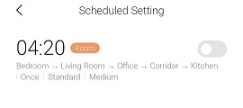
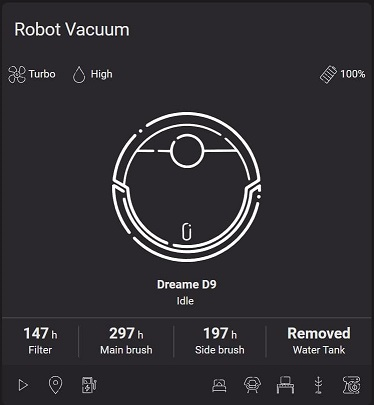

# xiaomi_vacuum (Dreame D9) integration for Homeassistant

A custom component for Dreame Vacuum Robot D9 (dreame.vacuum.p2009) with support for features such as consumables' lifespan, water level, room and zone cleaning, etc.  
This integration should also work for the following models:

- Dreame Vacuum Robot F9 (dreame.vacuum.p2008)
- Dreame Vacuum Robot L10 Pro (dreame.vacuum.p2029)

> :warning: This is WIP. I'm still refactoring and cleaning up the code so some things might change, for the better :)

- [xiaomi_vacuum (Dreame D9) integration for Homeassistant](#xiaomi_vacuum-dreame-d9-integration-for-homeassistant)
  - [Room cleaning support](#room-cleaning-support)
    - [Example of cleaning schedule:](#example-of-cleaning-schedule)
    - [Example of calling room cleaning service:](#example-of-calling-room-cleaning-service)
  - [Installing custom voice packs](#installing-custom-voice-packs)
    - [Example of install voice pack](#example-of-install-voice-pack)
  - [Remote controlling the robot](#remote-controlling-the-robot)
    - [Examples of calling remote control step service](#examples-of-calling-remote-control-step-service)
  - [Developement Status](#developement-status)
    - [Current list of attributes:](#current-list-of-attributes)
    - [Current list of services:](#current-list-of-services)
  - [Installation](#installation)
  - [Lovelace Card](#lovelace-card)
  - [Credit and Contribution](#credit-and-contribution)

## Room cleaning support

To use single room cleaning features (marked with <sup>1</sup> ), you need to create a schedule in `MiHome` app, which you can disable (but do not remove).  
Select the rooms you want to be displayed in HA.  
Do not choose `All` when creating the cleaning schedule.  
Select rooms one by one, and afterwards this integration can get a list of your rooms.  
If you have multiple maps create a schedule for each map. Afterwards you can also switch between the maps using this integration's `select_map` service

### Example of cleaning schedule:

In the following examples the selected rooms will show up in the same order. Other information, like time, speed, etc. is irrelevant.  


The resulting Homeassistant room list attribute:

```yaml
room_list:
  map_id_0:
    - B
    - E
    - D
    - C
    - A
```

Which means:

- B &#8594; Bedroom
- E &#8594; Living Room
- D &#8594; Office
- C &#8594; Corridor
- A &#8594; Kitchen

### Example of calling room cleaning service:

After the above step is done, room cleaning service can be called.

For example Cleaning the kitchen with `Two` passes, `Turbo` fan speed, and `High` water leve.

As action in `vacuum-card´:

```yaml
---
- name: Clean Kitchen
  icon: svg:kitchen
  service: xiaomi_vacuum.vacuum_clean_room_by_id
  service_data:
    entity_id: vacuum.dreame_d9
    rooms:
      - A
    repeats: 2
    clean_mode: 4
    mop_mode: 3
```

As service call:

```yaml
- service: xiaomi_vacuum.vacuum_clean_room_by_id
  data:
    entity_id: vacuum.dreame_d9
    rooms: ["A"]
    repeats: 2
    clean_mode: 4
    mop_mode: 3
```

It is also possible to specify the number of cleaning passes, fan speed, and water level for each room independently:

```yaml
  - service: xiaomi_vacuum.vacuum_clean_room_by_id
    data:
      entity_id: vacuum.dreame_d9
      rooms: [[ 'A', 2, 4, 3][ 'B', 1, 2, 3]]
      repeats: 2  >>> this will get override with this syntax
      clean_mode: 2. >>> this will get override with this syntax
      mop_mode: 2 >>> this will get override with this syntax
```

## Installing custom voice packs

It is possible to install custom voice packs using `vacuum_install_voice_pack` service.  
As a template for creating your own voice pack you can use the [default EN voice pack](http://awsde0.fds.api.xiaomi.com/dreame-product/dreame.vacuum.p2009/voices/package/en.tar.gz)

### Example of install voice pack

The following service call will install my voice pack named `en-azure.tar.gz` that I hosted localy on my development machine.  
In my experience if the `lang_id` is already available on your device, it will not download the pack again but only change the language to the already downloaded pack. So I used `US` instead of `EN`.

```yaml
service: xiaomi_vacuum.vacuum_install_voice_pack
data:
  entity_id: vacuum.dreame_d9
  lang_id: US
  url: http://192.168.31.176/en-azure.tar.gz
  md5: afee12651d96d26be46d898f647e8f0f
  size: 2532057
```

## Remote controlling the robot

It is also possible to remotely move the robot forward, backward or rotate it using `vacuum_remote_control_move_step` service.
This service requires the following attributes:

- velosity: the speed in which the robot moves. Positive values indicate a forward movement and negative values, backward. The value must be between 100 and -300.
- rotation: the angle of rotation in binary degrees. Positive Values indicate a CCW rotation and negative values, CW. The value must be between 128 and -128.

### Examples of calling remote control step service

Rotating the bot 45° CCW

```yaml
service: xiaomi_vacuum.vacuum_remote_control_move_step
data:
  entity_id: vacuum.dreame_d9
  rotation: 64
  velocity: 0
```

moving forward and turning 45° CW at the same time

```yaml
service: xiaomi_vacuum.vacuum_remote_control_move_step
data:
  entity_id: vacuum.dreame_d9
  rotation: -64
  velocity: 100
```

## Developement Status

### Current list of attributes:

- fan_speed_list
- battery_level
- battery_icon
- fan_speed
- status
- waterbox
- operation_status
- operating_mode
- error
- dnd_enabled
- dnd_start
- dnd_stop
- audio_volume
- audio_language
- timezone
- main_brush_time_left
- side_brush_time_left
- filter_time_left
- cleaning_area
- cleaning_time
- first_time_cleaning
- total_cleaning_time
- total_cleaning_count
- total_cleaning_area
- water_level: high
- water_level_list
- clean_cloth_tip
- serial_number
- map_id_list<sup>1</sup>
- room_list<sup>1</sup>

### Current list of services:

- Xiaomi Vacuum: vacuum_set_water_level
- Xiaomi Vacuum: vacuum_reset_filter_life
- Xiaomi Vacuum: vacuum_reset_main_brush_life
- Xiaomi Vacuum: vacuum_reset_side_brush_life
- Xiaomi Vacuum: vacuum_select_map<sup>1</sup>
- Xiaomi Vacuum: vacuum_clean_room_by_id<sup>1</sup>
- xiaomi Vacuum: vacuum_clean_zone
- xiaomi Vacuum: vacuum_set_restricted_zone
- xiaomi Vacuum: vacuum_install_voice_pack
- Xiaomi Vacuum: vacuum_set_clean_cloth_tip
- Xiaomi Vacuum: vacuum_remote_control_move_step

## Installation

Two possibilities for installation :

- Manually : add the "xiaomi_vacuum" folder to the /config/custom_components folder ; reboot
- With HACS : go in HACS, click on Integrations, click on the three little dots at top of the screen and selection "custom repositories", add this github url, select "Integration" as repository, and click ADD. Then go to the Integrations tab of HACS, and install the "Dreame Vacuum Robot D9" integration.

Code to add to configuration.yaml :

```
vacuum:
  - platform: xiaomi_vacuum
    host: <ip>
    token: "<token>"
    name: <name>
```

To retrieve the token, follow the default integration <a href="https://www.home-assistant.io/integrations/vacuum.xiaomi_miio/#retrieving-the-access-token">instructions</a>.

## Lovelace Card

This integration also works with https://github.com/denysdovhan/vacuum-card

Here is an example of modified version of vacuum-card:  


## Credit and Contribution

Thanks to the following people whitout them I could not do this.  
[python-miio by @rytilahti](https://github.com/rytilahti/python-miio) used for communicating with the device.  
[xiaomi_vacuum by @microfrost1](https://github.com/microfrost1/xiaomi_vacuum) used as basis of this fork.  
[xiaomi_vacuum by @Concentricc](https://github.com/Concentricc/xiaomi_vacuum) original xiaomi:vacuum for Vacuum 1C.  
[@need2buy](https://github.com/rytilahti/python-miio/issues/870#issuecomment-850623325) for original implementation of room cleaning feature and helping me get started.
